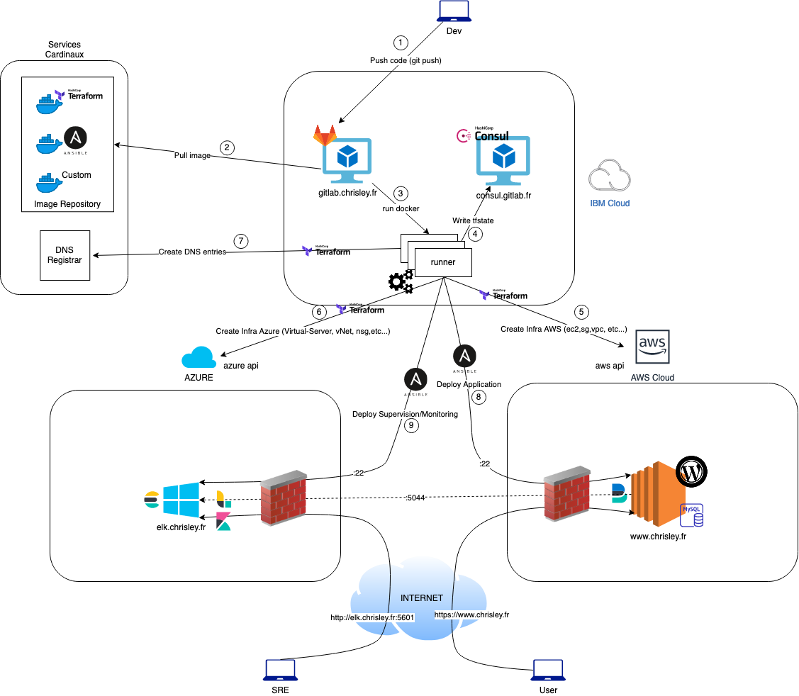
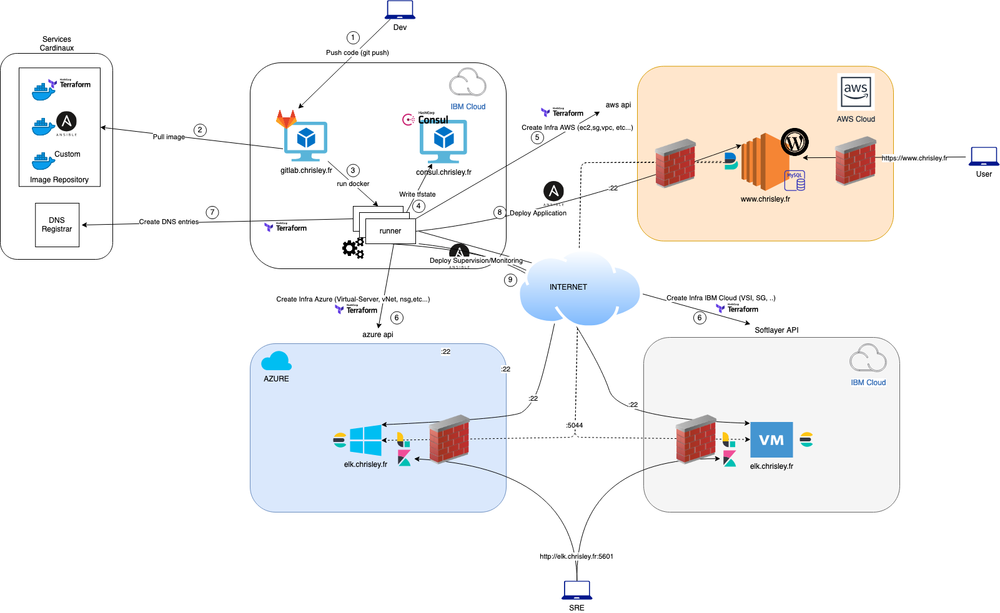

# IaC : Infrastructure as Code
##### What is IaC?
Infrastructure as Code (IaC) automates the provisioning of infrastructure, enabling your organization to develop, deploy, and scale cloud applications with greater speed, less risk, and reduced cost.

*source: https://www.ibm.com/cloud/learn/infrastructure-as-code*

# Presentation
The purpose of this demo is to demonstrate the possibilities of Infrastructure as Code (IaC) in a MultiCloud context.
Then we automatically deploy an application and the associated monitoring and supervision tools, using a CICD pipeline.

# Technologies
- Cloud Provider: **IBM Cloud, AWS Cloud, AZURE**
- Tool Chain - CICD: **Git, GitLab, GitLab-CI**
- IaC: **HashiCorp Suite: Terraform, Consul**
- Provisioning and Configuration management: **Ansible**
- Big Data and Monitoring: **ElasticSearch,  Logstash, Kibana, Filebeat, Metricbeat**
- Container: **Docker**
- SC: **AWS Route 53, DockerHub**

# Script
- CICD: continuous integration and continuous development with an automated GitLab pipeline (on IBM Cloud IaaS). 
- IaC: Terraform + Consul (Hashicorp suite) for infrastructure deployment
- Ansible: Application deployment (wordpress and database) 
- Big Data and Monitoring: We think SRE, and we will deploy an ELK chain for monitoring the application using Filebeat and Metricbeat as collector Agent
- MultiCloud: on AWS = the application, on IBM Cloud = ToolChain and on AZ or IBM Cloud = Big Data ELK 

# HLD - High Level Diagram

# HLD - High Level Diagram - Multi Cloud capabilities

# Author
**Christopher LEY**
SRE and MultiCloud Architect at IBM - IBM Services - christopher.ley@ibm.com
